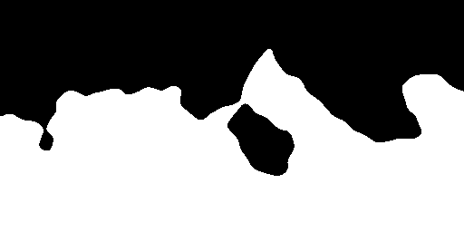
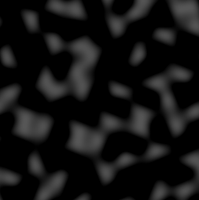
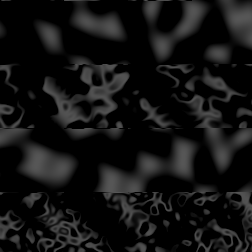

# Godot Accidental Noise Library module

[](https://travis-ci.com/Xrayez/godot-anl)
[](https://ci.appveyor.com/project/Xrayez/godot-anl/branch/master)

This is a wrapper for the new version of
[Accidental Noise Library](https://github.com/JTippetts/accidental-noise-library)
originally written by
[Joshua Tippetts](https://sourceforge.net/u/tippettsj/profile/), modified
to be properly compiled for [Godot 3.1](https://github.com/godotengine/godot)
and be used freely in GDScript.

The master branch aims to be in sync with Godot's master branch. Checkout other
branches and/or releases for compatible versions.

## Notable features:

* generate height, normal and bump maps from noise directly;
* ability to construct noise from visual nodes in editor and via code;
* make custom modular noise as components from base nodes.


See [wiki](https://github.com/Xrayez/godot-anl/wiki#visual-noise) on how to get started
creating noise with visual nodes.

## Overview

The AccidentalNoise class encapsulates the two main classes required for noise
generation: `CKernel` and `CNoiseExecutor`.

The kernel holds any amount of noise functions together creating compound noise
function. The noise executor then evaluates the function chain at any point of
the pipeline.

The library is full of features compared to other noise generation libraries with
a drawback of poorer performance.


## Installation

```bash
# Change directory to `modules` subfolder of Godot repository
cd godot/modules/
# Clone the module under directory named `anl`
git clone https://github.com/Xrayez/godot-anl.git anl && cd ..
# Compile the engine manually, for instance:
scons platform=windows target=release_debug bits=64
```

## Building notes

### Configuring noise period

Noise functions will have a period of 256; with coordinates higher than that,
the patterns will repeat. If a larger period is required, uncomment the
following statement in `SCsub` to use a long-period hash instead in exchange for a slight
decrease in performance:

```python
module_env.Append(CPPDEFINES=['ANL_LONG_PERIOD_HASHING'])
```

Alternatively, you can enable long-period hashing by defining the given preprocessor
variable before build:

```bash
scons platform=linux target=release_debug bits=64 define=ANL_LONG_PERIOD_HASHING
```

### Expression naming convention

The original library uses `camelCase` to parse function tokens in an expression,
yet the module uses `snake_case` to confirm to Godot's naming convention. If you
still want to use `camelCase` style, uncomment following statement in `SCsub`:

```python
module_env.Append(CPPDEFINES=['ANL_EXPRESSION_BUILDER_CAMELCASE'])
```

Or before build:

```bash
scons platform=linux target=release_debug bits=64 define=ANL_EXPRESSION_BUILDER_CAMELCASE
```

## Usage example

### Generating 2D landscape:

See [landscape.gd](examples/landscape_2d/landscape.gd).

### Result


You can also map the noise to an image with dedicated method instead to simplify
the above example:
```gdscript
image = noise.get_image(width, height)
```
... or even tiled texture!
```gdscript
noise.mode = AccidentalNoise.SEAMLESS_XY
texture = noise.get_texture(width, height)
```

Expression builder can be used to simplify the process of chaining
functions together to one-liners:

```gdscript
var n = AccidentalNoise.new()

var expression = "translate(select(0, 1, (x + y), 0.5, 0), 10)"
var function = noise.evaluate(expression)
var value = noise.color_2d(x, y, function)
```

But please note that the expression builder feature is a work in progress as
stated by original author. Some functions work, some don't and might crash the
engine.

## Programmable noise

As exposed in 2.0, it's possible to manipulate noise parameters via special noise
variables which are basically like `constant()` but can be set and retrieved by name.

See [random_noise.gd](examples/programmable_noise/random_noise.gd).

### Result




## Other examples
<details><summary>Texture synthesis</summary>
<p>


</p>
</details>

## Legal considerations

The original Accidental Noise Library uses Simplex noise for some of the noise
generation methods, implementation of which might be patented for uses in 3D and
higher for textured image synthesis. I'm not a lawyer, but I think using 2D
implementation of Simplex noise should be safe. I need to find that out someday.
I might look into integrating OpenSimplex noise instead, if this is the case.
