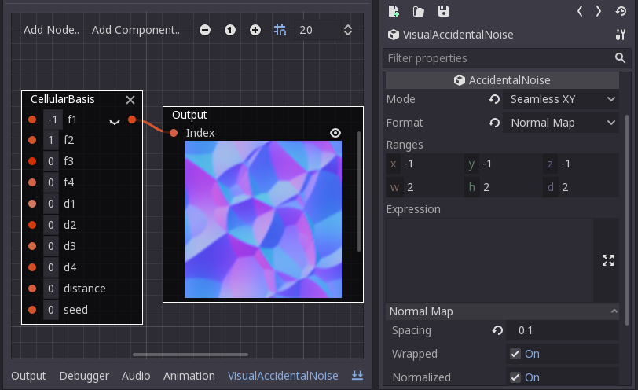

# Accidental Noise Library in Godot Engine


This is a wrapper for the
[Accidental Noise Library](https://github.com/JTippetts/accidental-noise-library)
originally written by
[Joshua Tippetts](https://sourceforge.net/u/tippettsj/profile/), modified
to be properly compiled for [Godot Engine](https://github.com/godotengine/godot)
and be used freely in both GDScript and C#.

The master branch aims to be in sync with Godot's master branch. Checkout other
branches and/or releases for compatible versions. You can decide which version 
you need based on the following compatibility table:

### Compatibility table (ANL/Godot)

|     | 3.0 | 3.1 | 3.2 | 4.0 |
| --: |:---:|:---:|:---:|:---:|
| 1.0 |  👍 |  👎 |  👎 | 👎  |
| 2.0 |  👎 |  👍 |  👎 | 👎  |
| 2.1 |  👎 |  👍 |  👍 | 🤞  |
| 2.2 |  👎 |  ❓ |  ❓  | 🤞  |

*Note: the latests versions may not be released yet and are kept for reference,
but expect them to be compatible.*

## Notable features:

* generate height, normal and bump maps from noise directly;
* ability to construct noise from visual nodes in editor and via code;
* make custom modular noise as components from base nodes.




See [wiki](https://github.com/Xrayez/godot-anl/wiki#visual-noise) on how to get started
creating noise with visual nodes.

## Overview

The AccidentalNoise class encapsulates the two main classes required for noise
generation: `CKernel` and `CNoiseExecutor`.

The kernel holds any amount of noise functions together creating compound noise
function. The noise executor then evaluates the function chain at any point of
the pipeline.

The library is full of features compared to other noise generation libraries with
a drawback of poorer performance.

## Compiling

If you'd like to try out or develop the module:

```bash
git clone https://github.com/Xrayez/godot-anl anl
scons
```

Note that `scons` will clone Godot Engine repository and compile the engine with
the module for you. Make sure that the module's directory name is exactly
`anl`. Once the compilation is done, the resulting binaries should be available
under `godot/bin` directory.

If you'd like to compile the module the traditional way, please refer to
[Godot Engine: Compiling](https://docs.godotengine.org/en/latest/development/compiling/)
documentation.

## Configuring the build

### Extending the noise period

Noise functions will have a period of 256; with coordinates higher than that,
the patterns will repeat. If a larger period is required, build with 
`anl_use_expressions_camelcase` command line option to use a long-period hash 
instead in exchange for a slight decrease in performance:

```bash
scons anl_use_long_period=yes
```

### Expression naming convention

The original library uses `camelCase` to parse function tokens in an expression,
yet the module uses `snake_case` to confirm to Godot's naming convention. If you
still want to use `camelCase` style, build with `anl_use_expressions_camelcase`
command line option:

```bash
scons anl_use_expressions_camelcase=yes
```

# Usage examples

## GDScript

### Generating 2D landscape:

See [landscape.gd](examples/landscape_2d/landscape.gd).

### Result


You can also map the noise to an image with dedicated method instead to simplify
the above example:
```gdscript
image = noise.get_image(width, height)
```
... or even tiled texture!
```gdscript
noise.mode = AccidentalNoise.SEAMLESS_XY
texture = noise.get_texture(width, height)
```

Expression builder can be used to simplify the process of chaining
functions together to one-liners:

```gdscript
var n = AccidentalNoise.new()

var expression = "translate(select(0, 1, (x + y), 0.5, 0), 10)"
var function = noise.evaluate(expression)
var value = noise.color_2d(x, y, function)
```

But please note that the expression builder feature is a work in progress as
stated by original author. Some functions work, some don't and might crash the
engine.

## C#

See demo project: [AnlTest.cs](examples/mono/AnlTest.cs).

```csharp
using Godot;
using System;

public class AnlTest : Godot.Node2D
{
	public override void _Ready()
	{
		AccidentalNoise an = new Godot.AccidentalNoise();
		AccidentalNoise.InterpolationTypes interp = AccidentalNoise.InterpolationTypes.Linear;
		int seed = 37;
		an.Function = an.GradientBasis(an.Constant((double)interp), an.Constant(seed));
		an.Function = an.Scale(an.Function, an.Constant(5.0));
		an.Mode = AccidentalNoise.MappingModes.Xy;
		ImageTexture noise = an.GetTexture(128, 128) as ImageTexture;
		GetNode<TextureRect>("Noise").Texture = noise;
	}
}
```

## Programmable noise

It's possible to modify noise parameters via special noise variables which are
like `constant()` but can be set and retrieved by name.

See [random_noise.gd](examples/programmable_noise/random_noise.gd).

### Result


## Other examples
<details><summary>Texture synthesis</summary>
<p>


</p>
</details>
