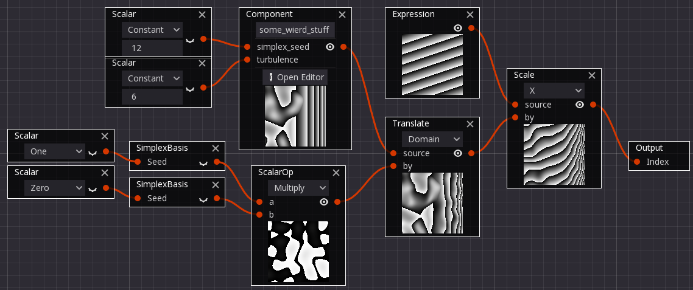

# Godot Accidental Noise Library module

[](https://travis-ci.com/Xrayez/godot-anl)
[](https://ci.appveyor.com/project/Xrayez/godot-anl/branch/master)

This is a wrapper for the new version of
[Accidental Noise Library](https://github.com/JTippetts/accidental-noise-library)
originally written by
[Joshua Tippetts](https://sourceforge.net/u/tippettsj/profile/), modified
to be properly compiled for [Godot 3.1](https://github.com/godotengine/godot)
and be used freely in GDScript.

The master branch aims to be in sync with Godot's master branch. Checkout other
branches and/or releases for compatible versions.

## WIP features:

* ability to construct noise from visual nodes in editor;
* make custom modular noise as components from base nodes.



The code structure is somewhat established for visual noise but can't be considered stable. Feel free to report bugs and contribute!

## Overview

The AccidentalNoise class encapsulates the two main classes required for noise
generation: CKernel, CNoiseExecutor

The kernel holds any amount of noise functions together creating compound noise
function. The noise executor then evaluates the function chain at any point of
the "pipeline"

The library is full of features compared to other noise generation libraries with
a drawback of poorer performance.

## Installation

```bash
# Change directory to `modules` subfolder of Godot repository
cd godot/modules/
# Clone the module under directory named `anl`
git clone https://github.com/Xrayez/godot-anl.git anl && cd ..
# Compile the engine manually, for instance:
scons platform=windows target=release_debug bits=64
```

## Building notes

### Configuring noise period

Noise functions will have a period of 256; with coordinates higher than that,
the patterns will repeat. If a larger period is required, uncomment the
following statement in `SCsub` to use a long-period hash instead in exchange for a slight
decrease in performance:

```python
# module_env.Append(CPPDEFINES=['ANL_LONG_PERIOD_HASHING'])
```

Alternatively, you can enable long-period hashing by defining the given preprocessor
variable before build:

```bash
scons platform=linux target=release_debug bits=64 define=ANL_LONG_PERIOD_HASHING
```

### Expression naming convention

The original library uses `camelCase` to parse function tokens in an expression,
yet the module uses `snake_case` to confirm to Godot's naming convention. If you
still want to use `camelCase` style, uncomment following statement in `SCsub`:

```python
# module_env.Append(CPPDEFINES=['ANL_EXPRESSION_BUILDER_CAMELCASE'])
```

Or before build:

```bash
scons platform=linux target=release_debug bits=64 define=ANL_EXPRESSION_BUILDER_CAMELCASE
```

## Usage example

```gdscript
var n = AccidentalNoise.new()

var gradient = n.y()

var fractal = n.fbm(AccidentalNoise.BASIS_GRADIENT, AccidentalNoise.INTERP_QUINTIC, 4, 3, randi())
var scale_offset = n.scale_offset(fractal, 0.5, 0)

var perturb = n.translate(gradient, scale_offset)

var select = n.select(
	n.zero(), n.one(),
	perturb, n.constant(0.5), n.zero()
)

n.function = select

var image = Image.new()
image.lock()

# Draw evaluated function
for y in range(HEIGHT):
	for x in range(WIDTH):
		var value = n.get_color_2d(x, y)
		image.set_pixel(x, y, value)

image.unlock()
```
You can also map the noise to an image with dedicated method instead:
```gdscript
image = n.get_image(width, height)
```
... or even tiled texture!
```gdscript
n.mode = AccidentalNoise.SEAMLESS_XY
texture = n.get_texture(width, height)
```

### Result


You can also use the expression builder to simplify the process of chaining
functions together to one-liners, something like this:

```gdscript
var n = AccidentalNoise.new()

var expression = "translate(select(0, 1, (x + y), 0.5, 0), 10)"
var function = n.evaluate(expression)
var value = n.color_2d(x, y, function)
```

But please note that the expression builder feature is a work in progress as
stated by original author. Some functions work, some don't and will hang the
engine in the endless loop...

Here's some more examples of image/texture generation:


## Legal considerations

The original Accidental Noise Library uses Simplex noise for some of the noise
generation methods, implementation of which might be patented for uses in 3D and
higher for textured image synthesis. I'm not a lawyer, but I think using 2D
implementation of Simplex noise should be safe. I need to find that out someday.
I might look into integrating OpenSimplex noise instead, if this is the case.
